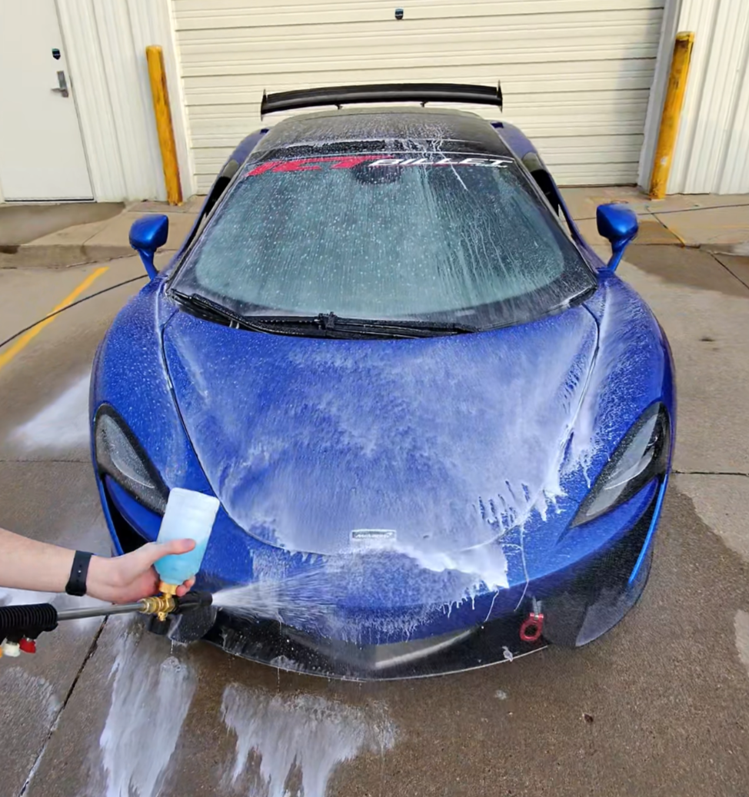
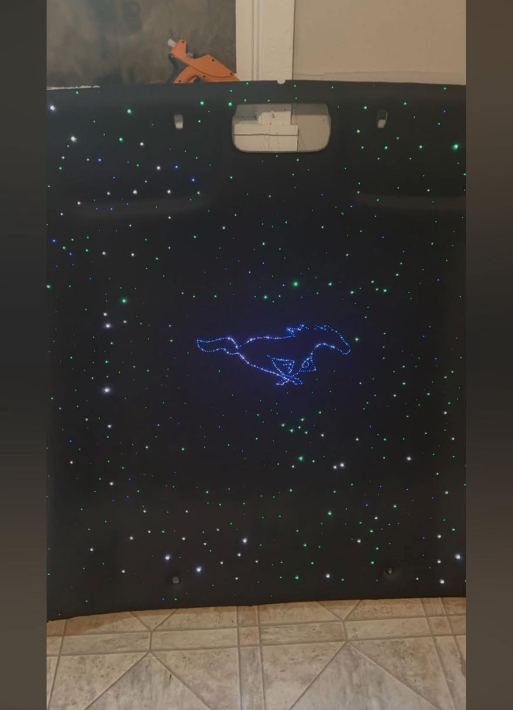
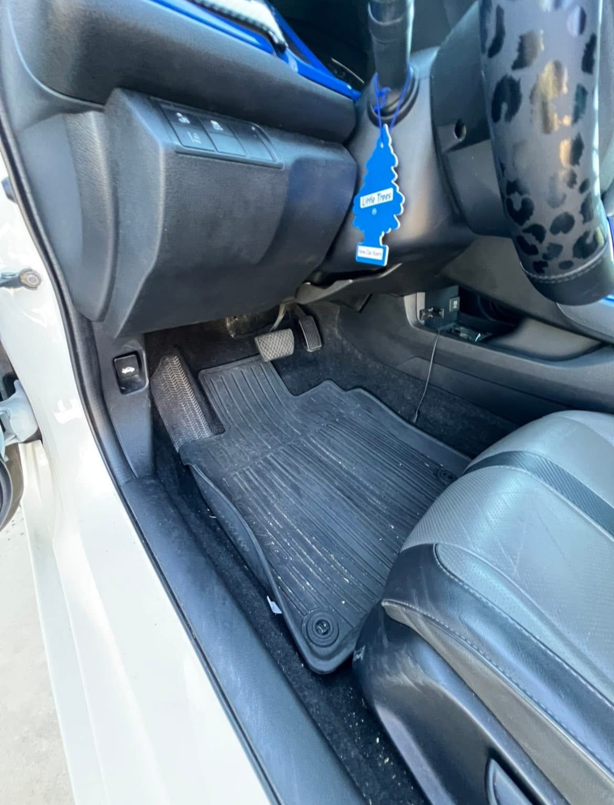
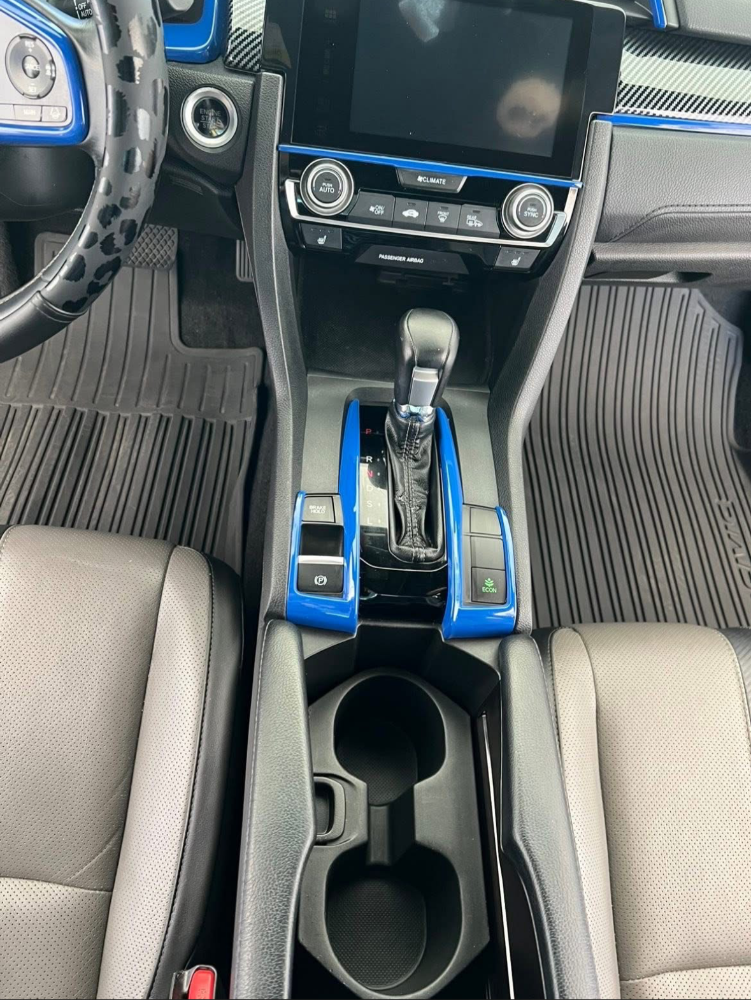
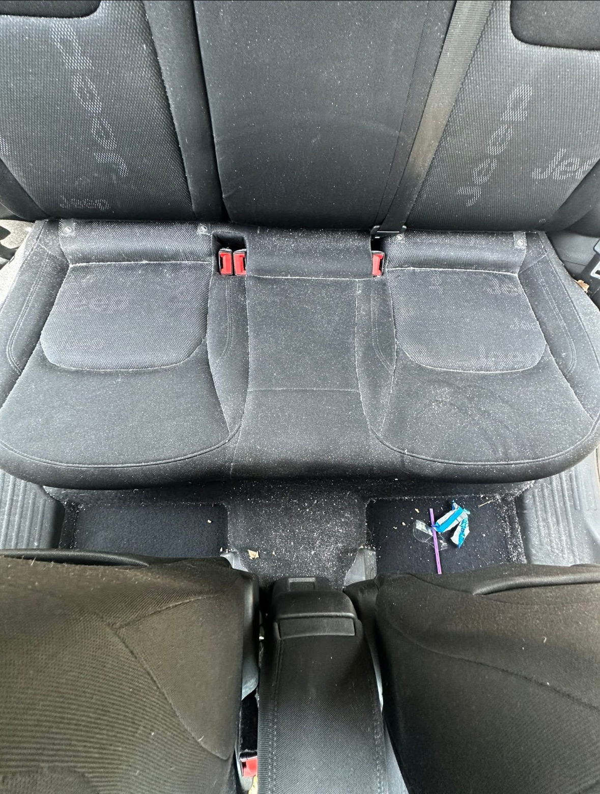
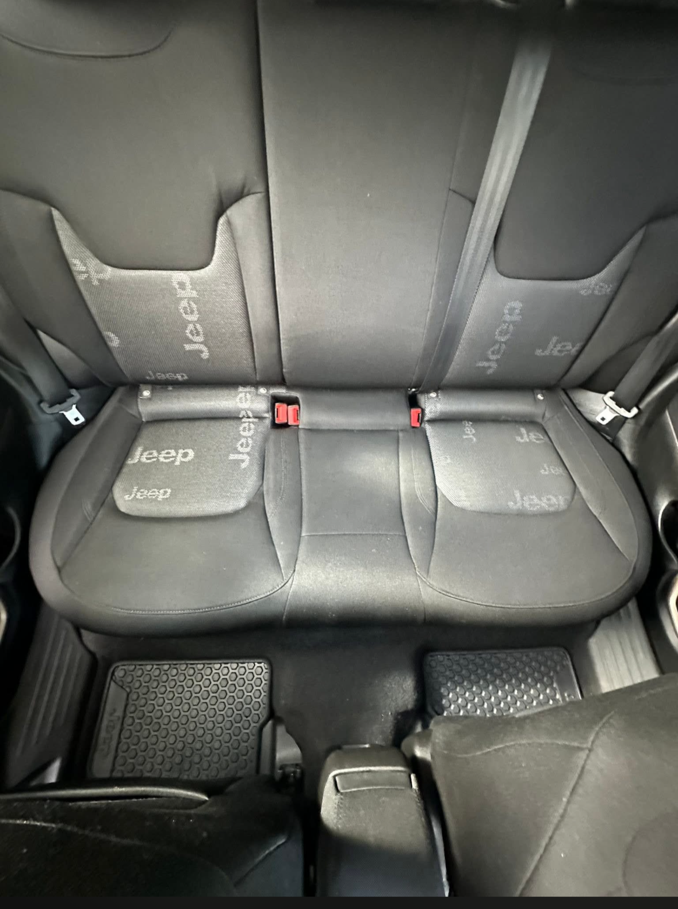
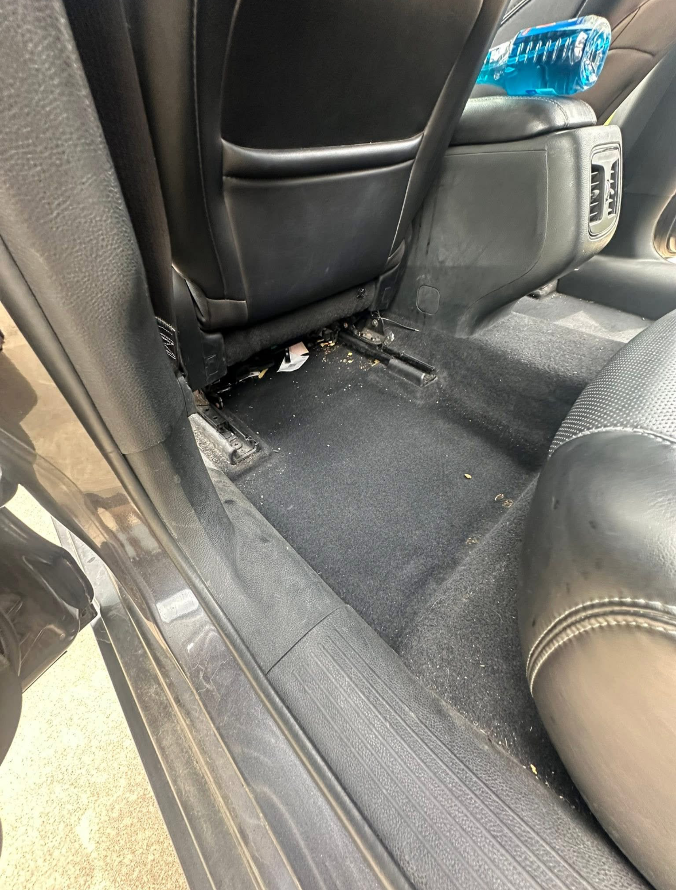
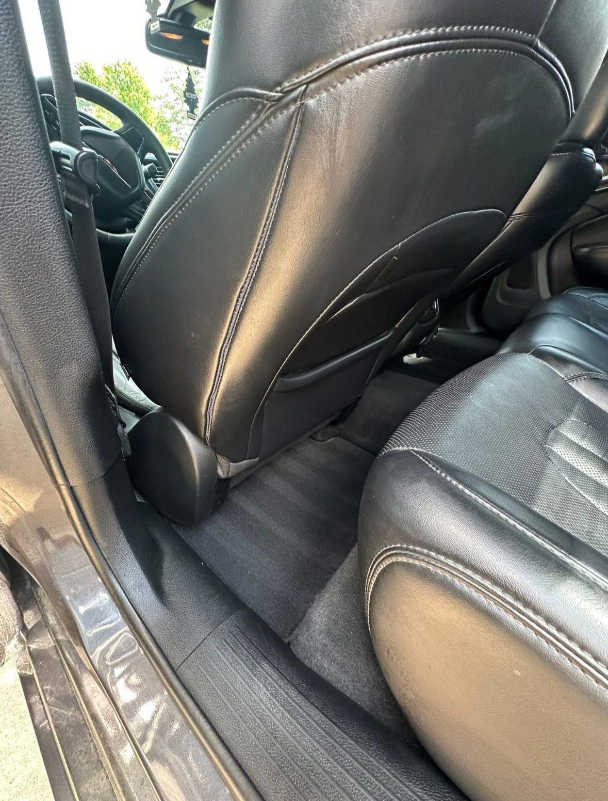
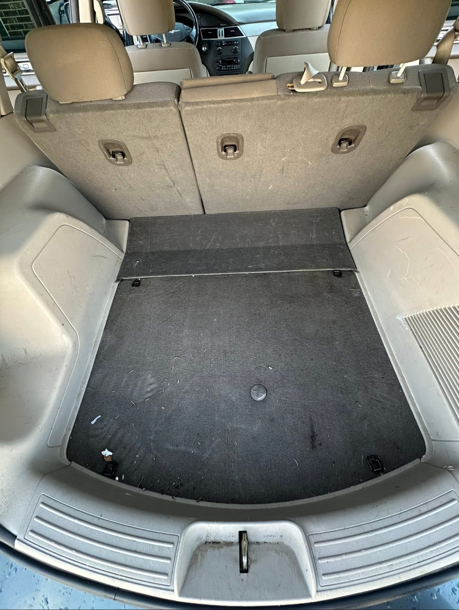
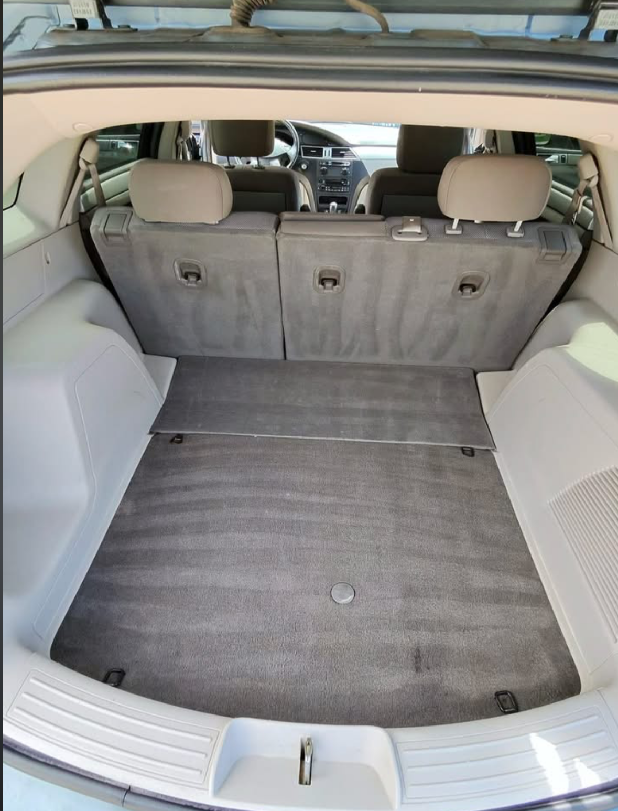

<!DOCTYPE html>
<html lang="en">
<head>
<meta charset="UTF-8">
<meta name="viewport" content="width=device-width, initial-scale=1.0">
<meta name="description" content="Premium mobile auto detailing, paint correction, ceramic coating, starlight headliners and more. We come to you in Wichita, KS. Call (316) 208-3234.">
<title>Nicety Auto Services — Premium Mobile Auto Care in Wichita, KS</title>
<link href="https://fonts.googleapis.com/css2?family=Cormorant+Garamond:wght@300;400;600&family=DM+Sans:wght@300;400;500;600&display=swap" rel="stylesheet">

</head>
<body>
 

  
📍 Wichita, KS & Surrounding Areas

  

    <a href="tel:3162083234">(316) 208-3234</a>
    <a href="https://meetings-na2.hubspot.com/kyle-rothrock" target="_blank" style="color:#3B82F6; font-weight:500;">Book Now</a>
  

 
<section class="hero">
  
  
Mobile Auto Care · Wichita, KS

  <h1 class="hero-title">Your car deserves <em>Nicety.</em></h1>
  
Professional detailing, paint correction, ceramic coating, and more — delivered to your home or office.

  <a href="https://meetings-na2.hubspot.com/kyle-rothrock" target="_blank" class="btn-book">Book Now</a>
  

    <a href="tel:3162083234">
      Call or Text
      (316) 208-3234
    </a>
    <a href="mailto:nicetymobile@gmail.com">
      Email Us
      nicetymobile@gmail.com
    </a>
  

</section>
 
<section id="services">
  

    
What We Do

    <h2 class="section-title">Every service your vehicle <em>deserves.</em></h2>
    

 
      

        
        

          
Mobile Detailing

          
Full interior & exterior detail at your home or office. We bring everything — you just unlock the car.

        

      

 
      

        
        

          
Paint Correction

          
Remove swirl marks, scratches, and oxidation. Restore your paint to a deeper, truer shine than the day you bought it.

        

      

 
      

        
        

          
Ceramic Coating

          
Nano-ceramic protection that bonds to your paint — repels water, dirt, and UV damage for years.

        

      

 
      

        
        

          
Starlight Headliners

          
Transform your interior with a custom fiber-optic starlight ceiling. The install everyone talks about.

        

      

 
      

        
        

          
Window Tint

          
Premium films for heat rejection, UV protection, and a clean blacked-out look.

        

      

 
      

        
        

          
Wraps

          
Full and partial vehicle wraps in any color or finish — matte, gloss, satin, or chrome.

        

      

 
      

        
        

          
Audio Install

          
Custom audio systems — head units, speakers, subwoofers, and amplifiers installed clean.

        

      

 
    

  

</section>
 
<section class="reviews-section" id="reviews">
  

    
Customer Reviews

    <h2 class="section-title">What Wichita <em>is saying.</em></h2>
    

      

 
        

          
★★★★★

          
"Kyle did an amazing job and would highly recommend them to everyone. They came and picked up my car and delivered it looking brand new!"

          
Shawna P.

        

 
        

          
★★★★★

          
"Man, I feel like i'm in a new vehicle fresh from the car dealership! Highly Recomment!!"

          
Mark M.

        

 
        

          
★★★★★

          
"Qaulity work and amazing attention to detail done in a timely fasion. Very good value would highly recommend to anyone."

          
Angelo C.

        

 
        

          
★★★★★

          
"Kyle from Nicety came out and did an excellent job on a full detail on my Ram and Ford. Going to be using this company again!"

          
Dakota C.

        

 
        

          
★★★★★

          
"Did an amazing job on my vehicle! Would totally recommend, Super nice and responsive as well!"

          
Jason S.

        

 
        

          
★★★★★

          
"Amazing customer service and results! I have two young kids who destroy my car but Kyle always brings it back to life! Efficient, kind, and reasonably priced!"

          
Skylar M.

        

 
      

    

    
← Scroll for more reviews →

  

</section>
 
<section id="gallery">
  

    
Before & After

    <h2 class="section-title">See the Nicety <em>difference.</em></h2>
    

      

 
        

          

            

              
              Before
            

            

              
              After
            

          

          
Job 1 — Edit this caption

        

 
        

          

            

              
              Before
            

            

              
              After
            

          

          
Job 3 — Edit this caption

        

 
        

          

            

              
              Before
            

            

              
              After
            

          

          
Job 5 — Edit this caption

        

 
        

          

            

              
              Before
            

            

              
              After
            

          

          
Job 6 — Edit this caption

        

 
        

          

            

              
              Before
            

            

              
              After
            

          

          
Job 7 — Edit this caption

        

 
      

    

    
← Scroll to see more →

  

</section>
 
<section class="cta-section" id="book">
  

    
Ready to Book?

    <h2 class="section-title">We come to <em>you.</em></h2>
    
No shop drop-off. No waiting around. Just showroom results at your door.

    <a href="https://meetings-na2.hubspot.com/kyle-rothrock" target="_blank" class="btn-book">Book Your Appointment</a>
    

      <a href="tel:3162083234">(316) 208-3234</a>
      <a href="mailto:nicetymobile@gmail.com">nicetymobile@gmail.com</a>
    

  

</section>
 
<footer>
  
  

    <a href="tel:3162083234">(316) 208-3234</a>
    <a href="mailto:nicetymobile@gmail.com">nicetymobile@gmail.com</a>
    <a href="https://www.facebook.com/share/18n3ppVXmS/?mibextid=wwXIfr" target="_blank">Facebook</a>
    <a href="#services">Services</a>
    <a href="#reviews">Reviews</a>
    <a href="#book">Book Now</a>
  

  
© 2026 Nicety Auto Services · Wichita, KS · All rights reserved.

</footer>
 

 
</body>
</html>
